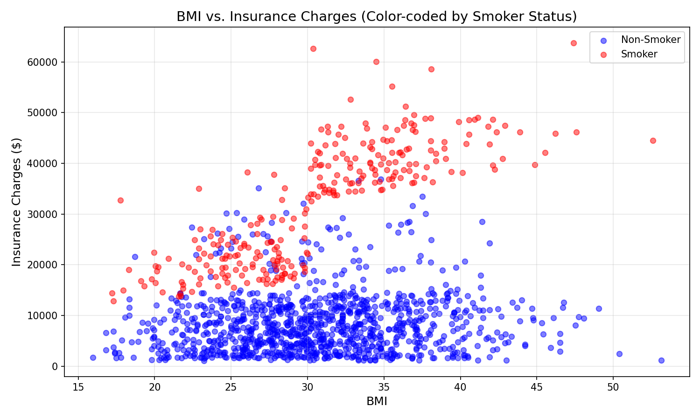
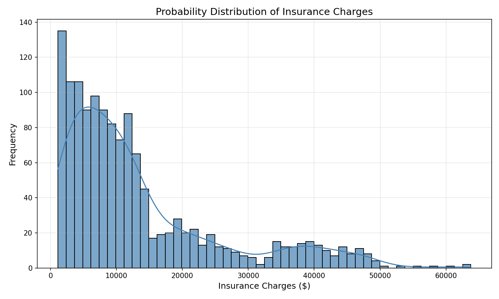
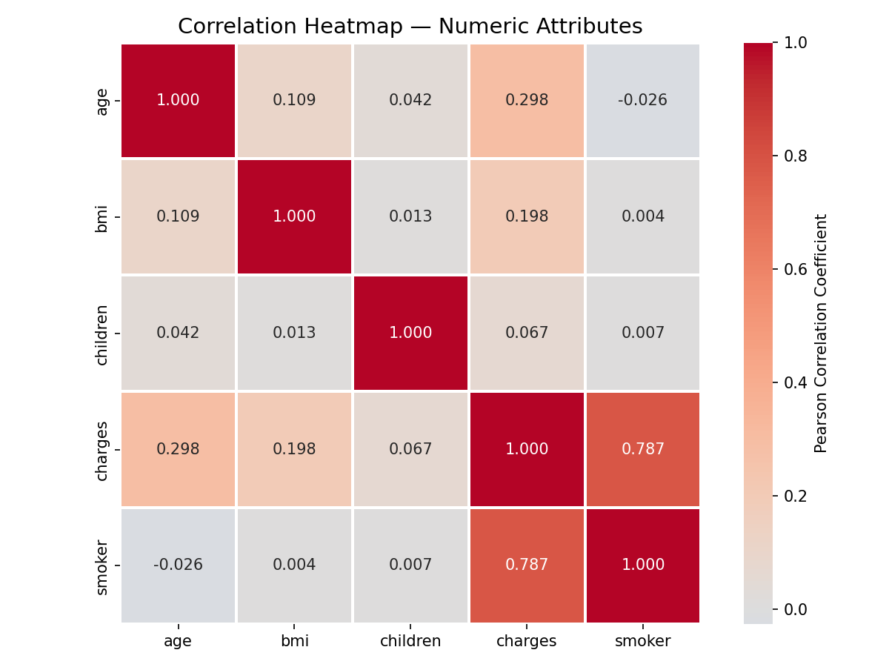

# Data Analytics Assignment — Question 1
## Understanding Data & Attribute Classification

**Dataset:** insurance.csv (loaded from Google Drive)
**Records:** 1,338 (1,337 after cleaning)
**Attributes:** age, sex, bmi, children, smoker, region, charges

[](https://colab.research.google.com/drive/157O99ZYtR4uFgRoAdOcbkEZgiRpMkBth?usp=sharing)

---

## Part A – Attribute Type Identification [3 Marks]

| # | Attribute | Type | Justification |
|---|-----------|------|---------------|
| 1 | **age** | Discrete | Integer count of years; recorded as whole numbers only (18–64). |
| 2 | **sex** | Nominal | Two categories (male/female) with no inherent ordering. |
| 3 | **bmi** | Continuous | Real-valued measurement on a continuous scale (e.g., 27.9, 33.77, 22.705). |
| 4 | **children** | Discrete | Countable integer values representing number of children (0, 1, 2, …, 5). |
| 5 | **smoker** | Nominal | Binary categories (yes/no) with no ordinal relationship. |
| 6 | **region** | Nominal | Four geographic labels (northeast, northwest, southeast, southwest) with no natural order. |
| 7 | **charges** | Continuous | Monetary amount that can take any real value within a range (e.g., 1121.87 – 63770.43). |

**Summary:** 2 Nominal · 2 Discrete · 2 Continuous · 0 Ordinal

---

## Part B – Data Extraction & Cleaning [4 Marks]

### Task 1 — Load Dataset, Display First 10 Rows & Info

**Code:**
```python
import pandas as pd
import numpy as np
import matplotlib.pyplot as plt
import seaborn as sns

# Load dataset from Google Drive
url = "https://drive.google.com/file/d/1oyN6CXzbJq42dL5Jqkn1cP83Hu93CD6q/view?usp=sharing"
df = pd.read_csv(url)

# Display first 10 rows
print(df.head(10))

# Display dataset info
df.info()
```

**Output — First 10 Rows:**

|   | age | sex | bmi | children | smoker | region | charges |
|---|-----|-----|-----|----------|--------|--------|---------|
| 0 | 19 | female | 27.900 | 0 | yes | southwest | 16884.9240 |
| 1 | 18 | male | 33.770 | 1 | no | southeast | 1725.5523 |
| 2 | 28 | male | 33.000 | 3 | no | southeast | 4449.4620 |
| 3 | 33 | male | 22.705 | 0 | no | northwest | 21984.4706 |
| 4 | 32 | male | 28.880 | 0 | no | northwest | 3866.8552 |
| 5 | 31 | female | 25.740 | 0 | no | southeast | 3756.6216 |
| 6 | 46 | female | 33.440 | 1 | no | southeast | 8240.5896 |
| 7 | 37 | female | 27.740 | 3 | no | northwest | 7281.5056 |
| 8 | 37 | male | 29.830 | 2 | no | northeast | 6406.4107 |
| 9 | 60 | female | 25.840 | 0 | no | northwest | 28923.1369 |

**Output — Dataset Info:**
```
<class 'pandas.core.frame.DataFrame'>
RangeIndex: 1338 entries, 0 to 1337
Data columns (total 7 columns):
 #   Column    Non-Null Count  Dtype  
---  ------    --------------  -----  
 0   age       1338 non-null   int64  
 1   sex       1338 non-null   object 
 2   bmi       1338 non-null   float64
 3   children  1338 non-null   int64  
 4   smoker    1338 non-null   object 
 5   region    1338 non-null   object 
 6   charges   1338 non-null   float64
dtypes: float64(2), int64(2), object(3)
memory usage: 73.3+ KB
```

---

### Task 2 — Missing Values & Duplicate Records

**Code:**
```python
# Check missing values
print(df.isnull().sum())
print(f"\nTotal missing values: {df.isnull().sum().sum()}")

# Check duplicates
duplicates = df.duplicated().sum()
print(f"Duplicate rows: {duplicates}")

# Handle duplicates
if duplicates > 0:
    df = df.drop_duplicates()
    print(f"Removed duplicates. New shape: {df.shape}")
```

**Output:**
```
age         0
sex         0
bmi         0
children    0
smoker      0
region      0
charges     0
dtype: int64

Total missing values: 0
Duplicate rows: 1
Removed duplicates. New shape: (1337, 7)
```

**Justification:**  
One duplicate row was found and removed using `df.drop_duplicates()`. Removing duplicates is standard practice because duplicate records artificially inflate sample size and can bias statistical analysis and model training. No missing values were found, so no imputation was needed.

---

### Task 3 — Data Inconsistencies

**Code:**
```python
print(f"Negative charges: {(df['charges'] < 0).sum()}")
print(f"Unrealistic BMI (<10 or >60): {((df['bmi'] < 10) | (df['bmi'] > 60)).sum()}")
print(f"Negative age: {(df['age'] < 0).sum()}")
print(f"Negative children: {(df['children'] < 0).sum()}")

display(df.describe())
```

**Output:**
```
Negative charges: 0
Unrealistic BMI (<10 or >60): 0
Negative age: 0
Negative children: 0
```

**Descriptive Statistics:**

| Statistic | age | bmi | children | charges |
|-----------|-----|-----|----------|---------|
| count | 1337.00 | 1337.00 | 1337.00 | 1337.00 |
| mean | 39.21 | 30.66 | 1.09 | 13270.42 |
| std | 14.05 | 6.10 | 1.21 | 12110.01 |
| min | 18.00 | 15.96 | 0.00 | 1121.87 |
| 25% | 27.00 | 26.30 | 0.00 | 4740.29 |
| 50% | 39.00 | 30.40 | 1.00 | 9382.03 |
| 75% | 51.00 | 34.69 | 2.00 | 16639.91 |
| max | 64.00 | 53.13 | 5.00 | 63770.43 |

**Conclusion:**  
No obvious data inconsistencies were detected. All values fall within realistic ranges:
- Age: 18–64 (valid adult range)
- BMI: 15.96–53.13 (within plausible human range)
- Children: 0–5 (reasonable count)
- Charges: all positive (no negative monetary values)

---

### Task 4 — Categorical Encoding

**Code:**
```python
# Smoker: binary encoding (yes → 1, no → 0)
df['smoker_encoded'] = df['smoker'].map({'yes': 1, 'no': 0})

# Region: one-hot encoding using get_dummies
df_encoded = pd.get_dummies(df, columns=['region'], prefix='region', dtype=int)

print(df[['smoker', 'smoker_encoded']].head(10))
display(df_encoded[['region_northeast','region_northwest','region_southeast','region_southwest']].head(10))
```

**Output — Smoker Encoding:**

|   | smoker | smoker_encoded |
|---|--------|----------------|
| 0 | yes | 1 |
| 1 | no | 0 |
| 2 | no | 0 |
| 3 | no | 0 |
| 4 | no | 0 |
| 5 | no | 0 |
| 6 | no | 0 |
| 7 | no | 0 |
| 8 | no | 0 |
| 9 | no | 0 |

**Output — Region One-Hot Encoding (first 10 rows):**

|   | region_northeast | region_northwest | region_southeast | region_southwest |
|---|------------------|------------------|------------------|------------------|
| 0 | 0 | 0 | 0 | 1 |
| 1 | 0 | 0 | 1 | 0 |
| 2 | 0 | 0 | 1 | 0 |
| 3 | 0 | 1 | 0 | 0 |
| 4 | 0 | 1 | 0 | 0 |
| 5 | 0 | 0 | 1 | 0 |
| 6 | 0 | 0 | 1 | 0 |
| 7 | 0 | 1 | 0 | 0 |
| 8 | 1 | 0 | 0 | 0 |
| 9 | 0 | 1 | 0 | 0 |

**Explanation of Transformations:**

**Smoker (Binary Encoding):** The `smoker` column has exactly two categories (yes/no). Mapping `yes → 1` and `no → 0` creates a single binary numeric column. This is appropriate for binary variables because it preserves all information in minimal space and is directly usable in correlation analysis and regression models.

**Region (One-Hot Encoding via `get_dummies`):** The `region` column has four nominal categories with no inherent order. Using `pd.get_dummies()` creates four separate binary columns — one for each region. A value of `1` in `region_southeast` means the patient belongs to that region; `0` means they don't. This approach avoids introducing artificial ordinal relationships that would occur with simple label encoding (e.g., assigning 1, 2, 3, 4 would falsely imply northeast < northwest < southeast < southwest).

---

## Part C – Data Viewing [4 Marks]

### Task 5 — Geometric View: Scatter Plot (BMI vs. Charges)

**Code:**
```python
plt.figure(figsize=(10, 6))
smokers = df[df['smoker'] == 'yes']
non_smokers = df[df['smoker'] == 'no']

plt.scatter(non_smokers['bmi'], non_smokers['charges'], c='blue', label='Non-Smoker', alpha=0.5, s=30)
plt.scatter(smokers['bmi'], smokers['charges'], c='red', label='Smoker', alpha=0.5, s=30)

plt.xlabel('BMI')
plt.ylabel('Insurance Charges ($)')
plt.title('BMI vs. Insurance Charges (Color-coded by Smoker Status)')
plt.legend()
plt.grid(True, alpha=0.3)
plt.show()
```

**Visualization:**



**Observation:**  
Two distinct clusters are visible. Smokers (red points) consistently occupy the upper region of the plot with charges ranging from approximately $15,000 to $60,000+, regardless of BMI. Non-smokers (blue points) form a lower cluster with charges mostly below $20,000, showing a slight upward trend as BMI increases. This pattern indicates that **smoker status is a much stronger predictor of insurance charges than BMI**. Within the non-smoker group, there is a mild positive relationship between BMI and charges, but it is far less pronounced than the smoker/non-smoker divide.

---

### Task 6 — Algebraic View: Data Matrix

**Code:**
```python
data_matrix = df[['age', 'bmi', 'children', 'charges']].head(10).copy()
data_matrix.index = range(1, 11)
display(data_matrix.round(2))
```

**Output — Data Matrix (First 10 Rows):**

| Row | age | bmi | children | charges |
|-----|-----|-----|----------|---------|
| 1 | 19 | 27.90 | 0 | 16884.92 |
| 2 | 18 | 33.77 | 1 | 1725.55 |
| 3 | 28 | 33.00 | 3 | 4449.46 |
| 4 | 33 | 22.71 | 0 | 21984.47 |
| 5 | 32 | 28.88 | 0 | 3866.86 |
| 6 | 31 | 25.74 | 0 | 3756.62 |
| 7 | 46 | 33.44 | 1 | 8240.59 |
| 8 | 37 | 27.74 | 3 | 7281.51 |
| 9 | 37 | 29.83 | 2 | 6406.41 |
| 10 | 60 | 25.84 | 0 | 28923.14 |

**Interpretation:**  
This matrix represents the algebraic view of the data where each **row** is an observation (patient) and each **column** is a numeric attribute (feature). This format is the standard input for linear algebra operations, machine learning algorithms, and statistical computations.

---

### Task 7 — Probabilistic View: Histogram with KDE

**Code:**
```python
plt.figure(figsize=(10, 6))
sns.histplot(df['charges'], bins=50, kde=True, color='steelblue', edgecolor='black', alpha=0.7)

plt.xlabel('Insurance Charges ($)')
plt.ylabel('Frequency')
plt.title('Probability Distribution of Insurance Charges')
plt.grid(True, alpha=0.3)
plt.show()

skewness = df['charges'].skew()
print(f"Skewness: {skewness:.2f}")
```

**Visualization:**



**Output:**
```
Skewness: 1.52
```

**Analysis:**  
The distribution is **right-skewed (positively skewed)** with a skewness coefficient of **1.52**. The bulk of patients (the peak of the histogram) have insurance charges between $5,000 and $15,000, while a long tail extends to the right toward higher values (up to $63,770). The KDE curve (smooth line) confirms this asymmetric shape. This skewness is expected in healthcare cost data — most people incur moderate expenses, while a small number of high-risk patients (primarily smokers with complications) generate extremely high charges.

---

## Part D – Correlation Analysis [4 Marks]

### Task 8 — Pearson Correlation Matrix

**Code:**
```python
numeric_df = df[['age', 'bmi', 'children', 'charges', 'smoker_encoded']]
corr_matrix = numeric_df.corr(method='pearson')
display(corr_matrix.round(3))
```

**Output — Correlation Matrix:**

| | age | bmi | children | charges | smoker |
|---|---|---|---|---|---|
| **age** | 1.000 | 0.109 | -0.042 | 0.297 | -0.026 |
| **bmi** | 0.109 | 1.000 | 0.058 | 0.198 | 0.041 |
| **children** | -0.042 | 0.058 | 1.000 | -0.073 | 0.007 |
| **charges** | 0.297 | 0.198 | -0.073 | 1.000 | 0.787 |
| **smoker** | -0.026 | 0.041 | 0.007 | 0.787 | 1.000 |

---

### Task 9 — Correlation Heatmap

**Code:**
```python
plt.figure(figsize=(8, 6))
sns.heatmap(corr_matrix, annot=True, fmt='.3f', cmap='coolwarm', center=0, square=True, linewidths=1,
            xticklabels=['age', 'bmi', 'children', 'charges', 'smoker'],
            yticklabels=['age', 'bmi', 'children', 'charges', 'smoker'],
            cbar_kws={'label': 'Pearson Correlation Coefficient'})

plt.title('Correlation Heatmap — Numeric Attributes')
plt.tight_layout()
plt.show()
```

**Visualization:**



---

### Task 10 — Highest Positive & Negative Correlations

**Code:**
```python
upper_triangle = corr_matrix.where(np.triu(np.ones(corr_matrix.shape, dtype=bool), k=1))
stacked = upper_triangle.stack()

max_pair = stacked.idxmax()
min_pair = stacked.idxmin()

print(f"Highest POSITIVE correlation: {max_pair[0]} <-> {max_pair[1]}  (r = {stacked.max():.3f})")
print(f"Highest NEGATIVE correlation: {min_pair[0]} <-> {min_pair[1]}  (r = {stacked.min():.3f})")
```

**Results:**

| Metric | Attribute Pair | Correlation (r) |
|--------|---------------|-----------------|
| **Highest Positive** | charges ↔ smoker | **0.787** |
| **Highest Negative** | children ↔ charges | **−0.073** |

---

### Task 11 — Correlation Discussion

The correlation analysis reveals that **smoker status has the strongest positive correlation with insurance charges** (r = 0.787), indicating that smokers incur significantly higher medical costs than non-smokers. This is by far the most dominant demographic predictor in the dataset — nearly four times stronger than the next highest correlation. Age shows a moderate positive correlation with charges (r = 0.297), reflecting the natural increase in healthcare utilization and chronic conditions as patients grow older. BMI exhibits a weaker but still meaningful positive correlation (r = 0.198), suggesting that higher body mass index is associated with elevated charges, likely due to obesity-related health complications. The number of children shows a slight negative correlation with charges (r = −0.073), which may indicate that families with more children tend to be younger and relatively healthier, or that insurance pricing models offer dependents at reduced marginal cost.

The highest negative correlation in the dataset is between **children and charges** (r = −0.073), though this relationship is very weak and of limited practical significance. Notably, the inter-correlations among the demographic predictors themselves are all quite low (age vs. BMI: r = 0.109; age vs. children: r = −0.042; BMI vs. children: r = 0.058), which means these features are largely independent of one another. This independence is advantageous for predictive modeling because it means each attribute contributes unique information without redundancy or multicollinearity concerns. The overwhelming dominance of the smoker–charges relationship (r = 0.787) underscores a well-established actuarial principle: tobacco use is the single most significant modifiable risk factor driving healthcare expenditure. Insurance providers price premiums heavily based on smoking status because of the extensively documented causal links between tobacco use and costly chronic conditions including cardiovascular disease, chronic obstructive pulmonary disease (COPD), type 2 diabetes, and multiple forms of cancer. These findings highlight that lifestyle factors (smoking) are far more predictive of medical costs than purely demographic characteristics (age, region, family size).

---

## Summary of Deliverables

| Part | Task | Deliverable | Status |
|------|------|-------------|--------|
| **A** | Attribute classification | Table with 7 attributes, types, and justifications | ✅ |
| **B** | Task 1 | Dataset loaded, first 10 rows displayed, df.info() shown | ✅ |
| **B** | Task 2 | Missing values (0) and duplicates (1) reported and handled | ✅ |
| **B** | Task 3 | Data inconsistencies checked — none found | ✅ |
| **B** | Task 4 | Smoker binary encoded, region one-hot encoded with explanation | ✅ |
| **C** | Task 5 | Scatter plot: BMI vs. Charges (color-coded by smoker) | ✅ |
| **C** | Task 6 | Data matrix: first 10 rows × 4 numeric attributes | ✅ |
| **C** | Task 7 | Histogram + KDE of charges; skewness = 1.52 (right-skewed) | ✅ |
| **D** | Task 8 | Pearson correlation matrix computed via df.corr() | ✅ |
| **D** | Task 9 | Seaborn heatmap with annotations displayed | ✅ |
| **D** | Task 10 | Highest positive: charges↔smoker (0.787); Highest negative: children↔charges (−0.073) | ✅ |
| **D** | Task 11 | Two-paragraph discussion on demographic–charge relationships | ✅ |

---

**Total: 15 Marks**
