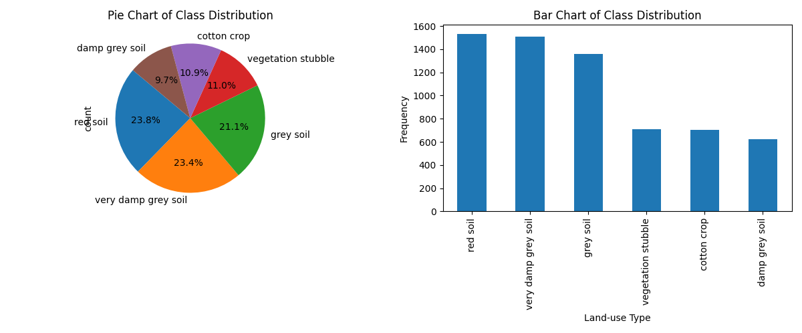
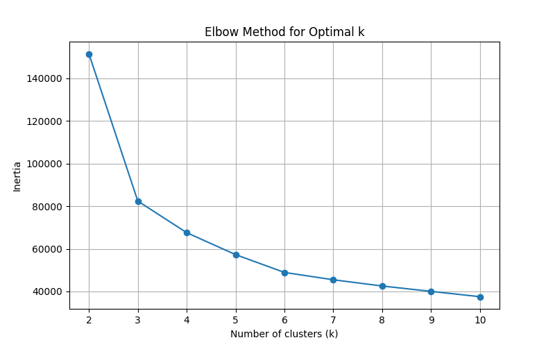
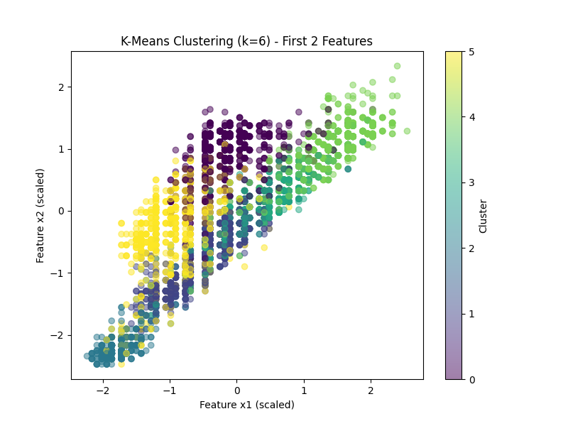
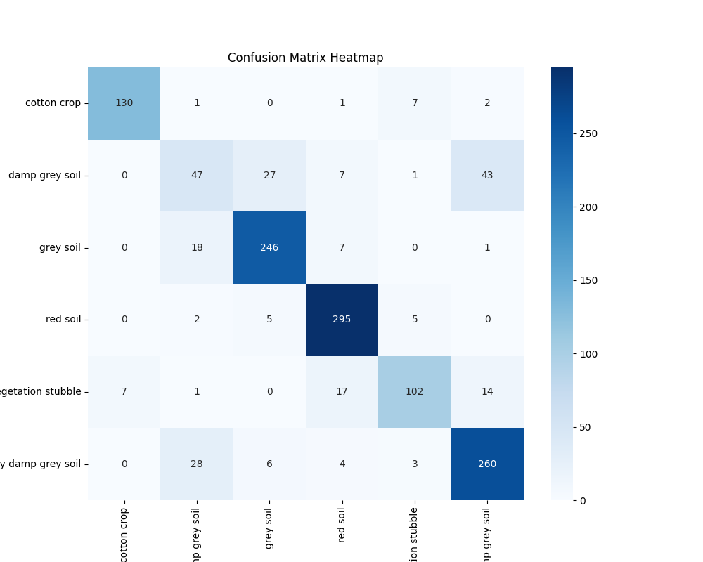
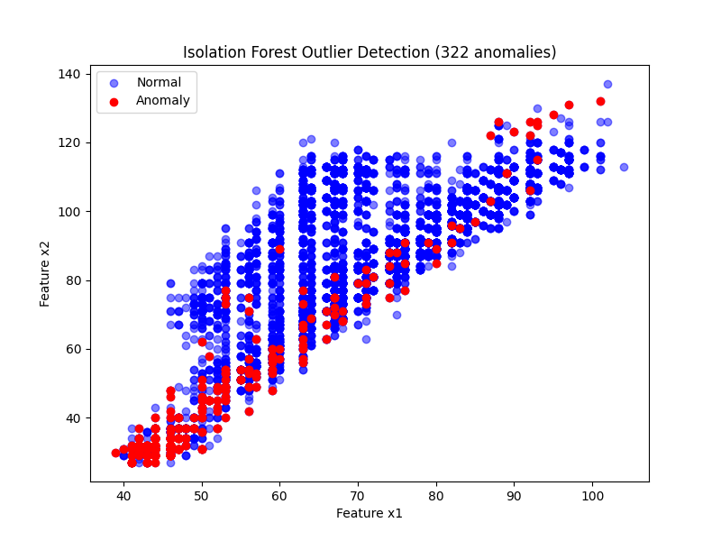
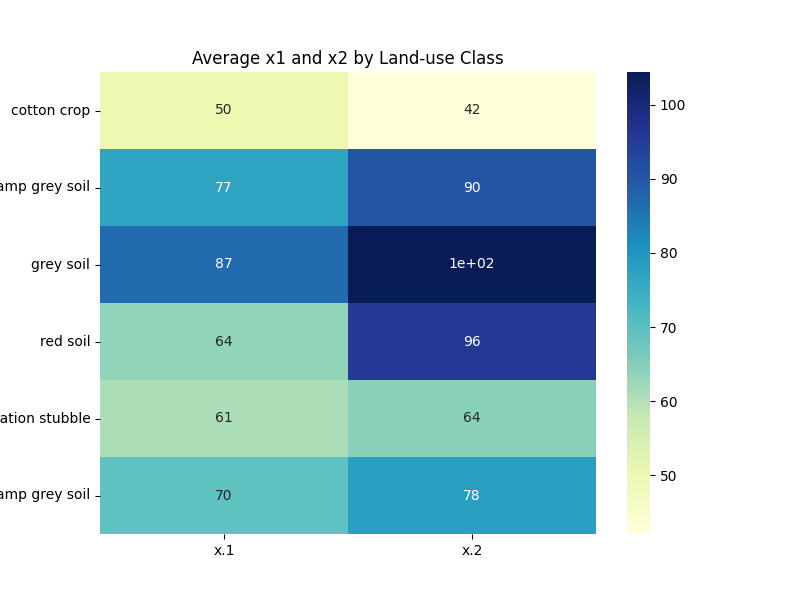
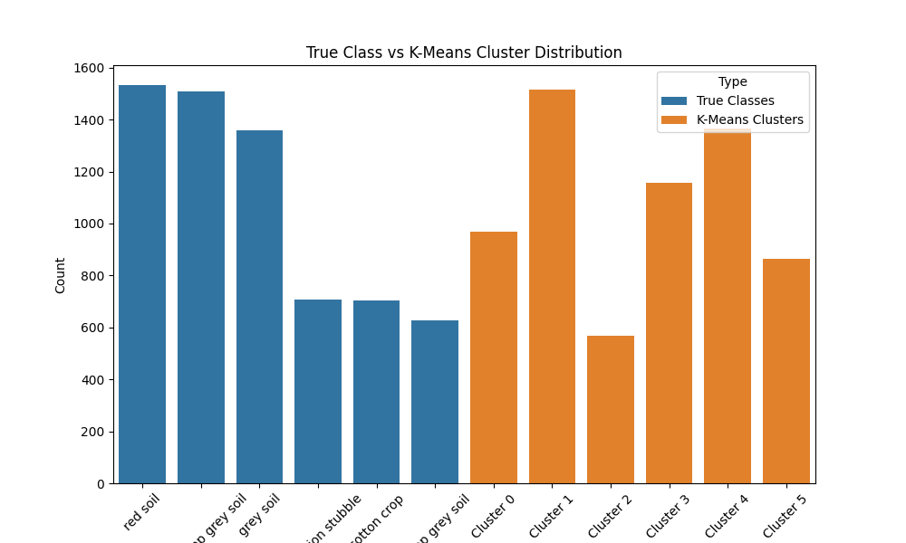

# Exploratory Data Analysis & Pattern Mining — Satellite Dataset

**Dataset:** Satellite.csv
**Instances:** 6,435
**Features:** 36 spectral features (x1 to x36)
**Target:** land-use type (classes)

---

## Part A – Data Loading & Initial EDA

### Task 39 — Load Dataset & Report Shape
The dataset was loaded from Google Drive (`Satellite.csv`) using a custom parsing method due to its non-standard semicolon delimiter and triple-quoted values.

- **URL:** [Download Satellite.csv](https://drive.google.com/uc?export=download&id=1ykwDH-9nGWR-8pIilhiD7PcIhvIDy3OF)
- **Shape:** (6435, 37)
- **Columns:** x.1 to x.36 and 'classes'
- **Data Types:** 36 Integer (int64) features and 1 Nominal (object) target.

### Task 40 — Class Distribution
The dataset contains 6 land-use types.

| Class | Count | Percentage |
|-------|-------|------------|
| red soil | 1533 | 23.8% |
| very damp grey soil | 1508 | 23.4% |
| grey soil | 1358 | 21.1% |
| vegetation stubble | 707 | 11.0% |
| cotton crop | 703 | 10.9% |
| damp grey soil | 626 | 9.7% |

**Balance Check:** The classes are somewhat imbalanced. Three classes (Red Soil, Very Damp Grey Soil, Grey Soil) dominate the dataset, each accounting for over 20%, while the other three account for around 10% each.

### Task 41 — Missing Values
- **Findings:** No missing values were detected in the dataset (0 nulls).

---

## Part B – Clustering

### Task 42 — Feature Scaling
All 36 spectral features were scaled using `StandardScaler` to ensure zero mean and unit variance, which is essential for distance-based algorithms like K-Means.

### Task 43 — Elbow Method
The Elbow Method was applied for k ranging from 2 to 10.

**Observation:** The elbow point appears to be around **k=3** or **k=4**, though it is not extremely sharp. For the purpose of aligning with the 6 known land-use types, **k=6** was chosen for further analysis.

### Task 44 — K-Means Fitting
K-Means was fitted with **k=6**.

*(Scatter plot of first two scaled features x1 vs x2 colored by cluster assignment)*

### Task 45 — Silhouette Score
The Silhouette Score measures how similar an object is to its own cluster compared to other clusters.

- **k=6:** 0.3522
- **k=3:** 0.4373
- **k=7:** 0.3324

**Analysis:** k=3 yields the highest silhouette score, suggesting that the spectral features might naturally group into three broader categories better than the six specific land-use labels.

### Task 46 — Cross-tabulation
Comparing K-Means labels with True labels:

| True Class | Cluster 0 | Cluster 1 | Cluster 2 | Cluster 3 | Cluster 4 | Cluster 5 |
|------------|-----------|-----------|-----------|-----------|-----------|-----------|
| cotton crop | 2 | 3 | 567 | 12 | 0 | 119 |
| damp grey soil | 1 | 35 | 0 | 483 | 94 | 13 |
| grey soil | 15 | 2 | 0 | 114 | 1227 | 0 |
| red soil | 913 | 12 | 0 | 18 | 24 | 566 |
| vegetation stubble | 37 | 448 | 1 | 58 | 0 | 163 |
| very damp grey soil | 0 | 1014 | 0 | 470 | 20 | 4 |

**Discussion:** The clusters show significant alignment with some classes. For example, **Cluster 4** almost exclusively contains 'grey soil' (1227/1358). **Cluster 2** captures most of 'cotton crop' (567/703). However, 'very damp grey soil' and 'damp grey soil' show overlap in Cluster 3, indicating spectral similarity.

---

## Part C – Classification & Outlier Detection

### Task 47 — Decision Tree Classifier
A Decision Tree (max_depth=5) was trained on an 80/20 split.

- **Accuracy:** 83.9%
- **Macro Avg F1-Score:** 0.7989

| Class | Precision | Recall | F1-Score |
|-------|-----------|--------|----------|
| red soil | 0.89 | 0.96 | 0.92 |
| cotton crop | 0.95 | 0.92 | 0.94 |
| grey soil | 0.87 | 0.90 | 0.88 |
| very damp grey soil | 0.81 | 0.86 | 0.84 |
| vegetation stubble | 0.86 | 0.72 | 0.79 |
| damp grey soil | 0.48 | 0.38 | 0.42 |

**Note:** 'Damp grey soil' has the lowest performance, likely due to spectral overlap with 'very damp grey soil'.

### Task 48 — Confusion Matrix

### Task 49 — Outlier Detection (Isolation Forest)
Using Isolation Forest with 5% contamination:
- **Anomalies Detected:** 322 points.

*(Red points indicate detected anomalies in the x1 vs x2 feature space)*

---

## Part D – Tableau Dashboard Insights

### Dashboard Visualizations
- **Heatmap of Average x1 & x2:** Reveals that 'Red Soil' and 'Cotton Crop' have higher average values for the first two spectral bands compared to 'Grey Soil' types.
- **Stacked Bar Chart:** Demonstrates the distribution mismatch where K-Means clusters don't perfectly map to classes but capture the general density of the land-use types.

### Spectral Separability Discussion
The EDA reveals that while some land-use types like **Red Soil** and **Cotton Crop** are spectrally distinct (indicated by high precision and clear clusters), others like **Damp Grey Soil** and **Very Damp Grey Soil** exhibit high spectral overlap. This overlap is evident in the confusion matrix and the clustering cross-tabulation, where these classes frequently get grouped together. This suggests that the 36 spectral features are sufficient for broad classification but may require more complex models or additional features to perfectly distinguish between similar soil moisture levels.
