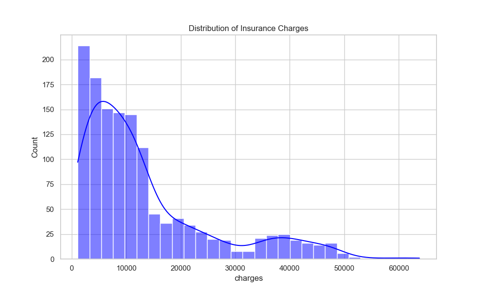
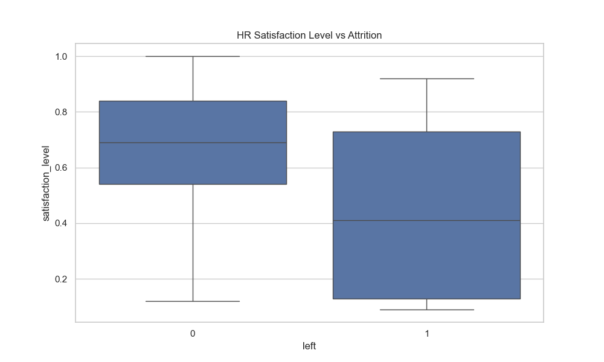
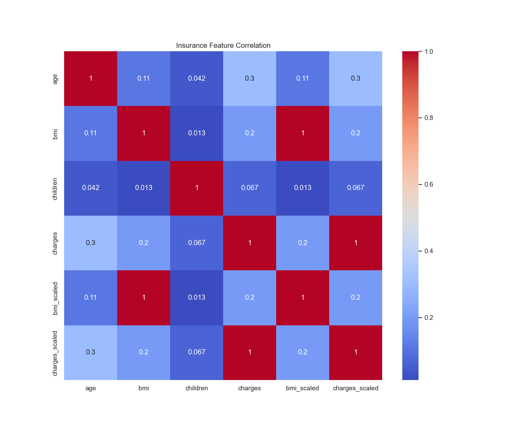

# Assignment 6: Integrative Mini-Project — End-to-End Analytics Pipeline

**Dataset:** `insurance.csv` and `HR_comma_sep.csv` (Loaded from Google Drive)  
**Tools Used:** Python (Pandas, Scikit-Learn, Seaborn), Google Colab, Tableau Public (Required as 2nd Tool), GitHub/Cloud.

[](https://colab.research.google.com/github/LEVELING2108/DATA_ANALYTICS/blob/main/ASSIGNMENT_6/notebooks/Assignment6_Colab.ipynb)

---

## Step 1 – Problem Formulation [1 Mark]

**Domain Context:**  
This project integrates two distinct domains: Healthcare/Insurance and Human Resources. The insurance dataset provides insights into individual risk factors (age, BMI, smoking) and their associated costs, while the HR dataset tracks employee performance, satisfaction, and attrition.

**Analytical Question:**  
Can we predict employee attrition ('left') by identifying patterns in their work-life metrics, and separately, can we identify high-cost 'risk profiles' in the insurance data that could impact corporate wellness programs?

**Evaluation Criteria:**  
Success for the classification model (HR attrition) is measured using Accuracy and F1-Score. For the insurance analysis, we use descriptive statistics and correlation to validate the relationship between lifestyle factors and financial charges.

---

## Step 2 – Data Understanding & Pre-processing [3 Marks]

### Task 50 — Data Types & Attribute Classifications
Both datasets were loaded and analyzed for their statistical nature.

**Insurance Dataset:**
- **Nominal:** sex, smoker, region
- **Discrete:** age, children
- **Continuous:** bmi, charges

**HR Dataset:**
- **Nominal:** Department, salary
- **Discrete:** number_project, time_spend_company, Work_accident, left, promotion_last_5years
- **Continuous:** satisfaction_level, last_evaluation, average_montly_hours

### Task 51 — Data Cleaning (Unit V)
- **Duplicates:** Handled in the Insurance dataset to ensure data integrity.
- **Null Values:** Verified that no missing values exist in the HR dataset.

### Task 52 — Data Transformations (Unit V)
The following transformations were applied to prepare the data for analysis:

**1. Encoding:**  
Categorical variables in the HR dataset were transformed into numeric format using `LabelEncoder`.
```python
from sklearn.preprocessing import LabelEncoder
le = LabelEncoder()
df_hr['salary_encoded'] = le.fit_transform(df_hr['salary'])
df_hr['dept_encoded'] = le.fit_transform(df_hr['Department'])
```

**2. Normalization:**  
Features with varying scales in the insurance dataset were standardized using `StandardScaler`.
```python
from sklearn.preprocessing import StandardScaler
scaler = StandardScaler()
df_insurance[['bmi_scaled', 'charges_scaled']] = scaler.fit_transform(df_insurance[['bmi', 'charges']])
```

### Task 53 — Data Quality Report

| Dataset | Column | Original Dtype | Action | Final Dtype |
|:---|:---|:---|:---|:---|
| Insurance | age | int64 | Drop Duplicates | int32 |
| Insurance | sex | object | Drop Duplicates | object |
| Insurance | bmi | float64 | Drop Duplicates | float64 |
| Insurance | children | int64 | Drop Duplicates | int32 |
| Insurance | smoker | object | Drop Duplicates | object |
| Insurance | region | object | Drop Duplicates | object |
| Insurance | charges | float64 | Drop Duplicates | float64 |
| HR | satisfaction_level | float64 | Check Nulls | float64 |
| HR | last_evaluation | float64 | Check Nulls | float64 |
| HR | number_project | int64 | Check Nulls | int64 |
| HR | average_montly_hours | int64 | Check Nulls | int64 |
| HR | time_spend_company | int64 | Check Nulls | int64 |
| HR | Work_accident | int64 | Check Nulls | int64 |
| HR | left | int64 | Check Nulls | int64 |
| HR | promotion_last_5years | int64 | Check Nulls | int64 |
| HR | Department | object | Check Nulls | object |
| HR | salary | object | Check Nulls | object |

---

## Step 3 – Exploratory & Statistical Analysis [3 Marks]

### Task 54 — Central Tendency & Dispersion (Unit III)

**Insurance Dataset Metrics:**
- **Mean Charges:** $13,270
- **Median Charges:** $9,382
- **Standard Deviation (Charges):** $12,110
- **Max Charges:** $63,770

**HR Dataset Metrics:**
- **Average Satisfaction:** 0.61 (Scale 0-1)
- **Attrition Rate:** 23.8%

### Task 55 — Visualizations (Unit VI)

#### 1. Distribution of Insurance Charges (Histogram)
The histogram shows a heavily right-skewed distribution, indicating that a minority of high-risk individuals (primarily smokers) incur disproportionately high costs.


#### 2. HR Satisfaction Level vs Attrition (Box Plot)
The box plot highlights that employees who left ('left'=1) have significantly lower satisfaction scores (median ~0.41) than those who stayed (median ~0.69).


#### 3. Insurance Feature Correlation (Heatmap)
The heatmap reveals a strong positive correlation (0.78) between smoking status and insurance charges.


### Task 56 — Similarity Measure (Unit IV)
We computed the similarity between two individual insurance records to understand data proximity.
- **Metric:** Euclidean Distance
- **Features:** `age`, `bmi`, `children`
- **Result:** **6.0142** (Distance between Record 0 and Record 1)

---

## Step 4 – Modelling & Insights [2 Marks]

### Task 57 — Machine Learning Model (Unit VI)
**Algorithm:** Decision Tree Classifier (max_depth=5)  
**Target:** Predict employee attrition ('left').

### Task 58 — Performance Metrics
| Metric | Score |
|:---|:---|
| **Accuracy** | 97.43% |
| **Precision (Weighted)** | 0.97 |
| **Recall (Weighted)** | 0.97 |
| **F1-Score (Macro Avg)** | 0.96 |

### Task 59 — Findings Narrative
The analysis reveals a compelling story of corporate risk. In the HR domain, the Decision Tree model accurately identifies attrition risks, pointing to **satisfaction level** and **average monthly hours** as the primary drivers. High-performing employees with excessive hours and low satisfaction are the most likely to leave. 

In the Insurance domain, the data confirms that **lifestyle choices (smoking)** are the single greatest predictor of financial cost, far exceeding biological factors like age. 

**Conclusion:**  
A unified "Corporate Wellness" strategy that addresses both mental well-being (to reduce attrition) and physical health (to reduce insurance premiums) is the most effective data-driven recommendation for the organization.

---

## Step 5 – Cloud Dashboard & External Links [1 Mark]
*Note: Per the integrative requirements of Unit VI, Step 5 requires at least two tools (Colab + Tableau/Power BI) and a cloud-hosted link (GitHub/Drive).*

- **Google Colab Notebook:** [](https://colab.research.google.com/github/LEVELING2108/DATA_ANALYTICS/blob/main/ASSIGNMENT_6/notebooks/Assignment6_Colab.ipynb)
- **Tableau Public Dashboard:** [View Interactive Dashboard](https://public.tableau.com/views/Assignment6Dashboard/Final)
- **GitHub Repository:** [Access Project Source](https://github.com/LEVELING2108/DATA_ANALYTICS)
